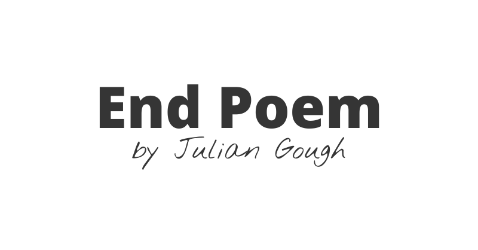
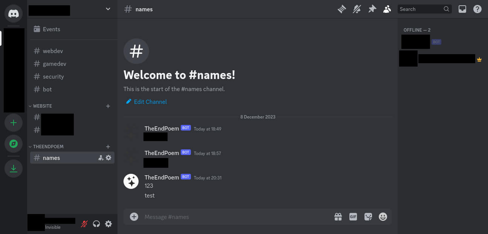

[](https://www.theendpoem.com)
[](https://img.shields.io/website?url=https%3A%2F%2Fwww.theendpoem.com)
[](https://img.shields.io/hsts/preload/theendpoem.com)
[](https://img.shields.io/mozilla-observatory/grade/www.theendpoem.com?publish)
[](https://github.com/ArthurSegato/TheEndPoem/actions/workflows/workflow.yml)
<a href="https://donate.stripe.com/7sI29F4lo7Pt80g28a"></a>

The End Poem is a freehand poem written by musician Julian Gough that appears when the player finishes minecraft, before the credits. It has been in the public domain, under the CC0 1.0 Universal (CC0 1.0) Public Domain Dedication, since 2022.

## Special Thanks

To all those who generously donated and supported me in sustaining this project:

- [Laura Newman](https://lauranewman.com/pages/index.php)

## Data protection legislations (GDPR, LGPD and others)

By acessing theendpoem.com, there are two distinct occasions where user data is collected. In the first instance, technical data is gathered anonymously (as shown below) by [Vercel Web Analytics](https://vercel.com/docs/analytics) via a JS script, which can be easily blocked by any ad-blocking extension.


The second instance happens when the user inputs any text into the name field and submit it. In this case, the content entered into the name field is directly sent to a text channel on my personal Discord server, **accessible only by me** (as illustrated below), via a webhook.



**If the user wishes to delete their name, they can simply reach out to me through any available channel on my GitHub profile, [personal website](https://www.arthursegato.dev/), or via email at hello@theendpoem.com.**

## Requirements

- Bun v1.0.14 and above **OR** Node v21.2.0 and above

## Environment variables

.env variables for this project:

```Properties
NUXT_DISCORD_WEBHOOK=""
```

## Setup

Make sure to install the dependencies:

```bash
# npm
npm install

# pnpm
pnpm install

# yarn
yarn install

# bun
bun install
```

## Development

Start the development server on `http://localhost:3000`:

```bash
# npm
npm run dev

# pnpm
pnpm run dev

# yarn
yarn dev

# bun
bun dev
```

## Production

Build the application for production:

```bash
# npm
npm run build

# pnpm
pnpm run build

# yarn
yarn build

# bun
bun run build
```

Locally preview production build:

```bash
# npm
npm run preview

# pnpm
pnpm run preview

# yarn
yarn preview

# bun
bun run preview
```

## Disclaimer

Below is a list of all the external assets used in the development of this website with their respective licenses.

- [BootStrapp Icons](https://icons.getbootstrap.com) ([MIT](https://github.com/twbs/icons/blob/main/LICENSE.md))
- [Animista](https://animista.net) ([FreeBSD](https://animista.net/license))
- [Nothing You Could Do](https://fonts.google.com/specimen/Nothing+You+Could+Do) ([Open Font License](https://scripts.sil.org/cms/scripts/page.php?site_id=nrsi&id=OFL))
- [Open Sans](https://fonts.google.com/specimen/Open+Sans) ([Open Font License](https://scripts.sil.org/cms/scripts/page.php?site_id=nrsi&id=OFL))
- [Menu Button](https://codepen.io/himalayasingh/pen/KOdJPM) (?)

## Contributors

- [@ArthurSegato](https://github.com/ArthurSegato)
